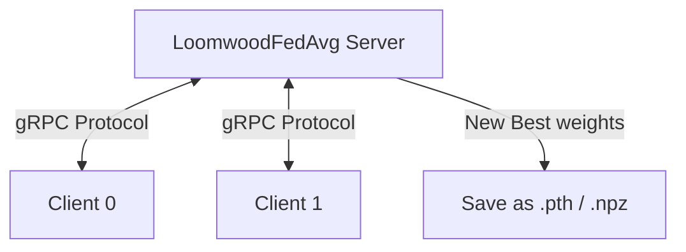

# Federated Learning (FL) Documentation

This document explains the Federated Learning setup, local server execution, client joining, and weight conversion strategy.

Current runtime note: FL correction now targets the notebook-trained `NepaliCorrectionModel` and writes `models/nepali_correction_best.pth`. The previous `models/seq2seq_best.pth` corrector is not the default runtime model.

---

## Architecture Overview

The system uses **Flower (flwr)** as the Federated Learning framework, running on local/client machines.



1. **Flower Server**: Coordinates rounds, selects clients, sends parameters, aggregates parameter updates, and runs global evaluation.
2. **Flower Clients**: Receive model parameters, train on local slices of the dataset using PyTorch, and send updated parameters back.
3. **Bridge API**: A FastAPI instance running inside the FL server process that allows the frontend web UI to export updated models to ONNX or import updated weights.

---

## 1. Running the Server

Start the FL server and ONNX Bridge API.

```bash
# Start both Detector and Corrector FL servers
python main.py --mode fl --fl-model both

# Start only Detector FL server
python main.py --mode fl --fl-model detector
```

### Server Ports:
- **Detector FL Server**: `8080`
- **Corrector FL Server**: `8081`
- **ONNX Bridge API**: `8082`

---

## 2. Running a Client

Start a local training client. The client will load the tokenizer, partition the dataset, and connect to the FL server.

```bash
# Run Detector client 0
python fl/client.py --model detector --client-id 0 --total-clients 2

# Run Detector client 1
python fl/client.py --model detector --client-id 1 --total-clients 2
```

---

## 3. Weight Conversion Strategy

Flower represents model weights as a list of NumPy arrays (`parameters_to_ndarrays`), whereas PyTorch loads and saves weights using a `state_dict` mapping.

### How weights are serialized:
- **Round checkpoints**: Aggregated parameters for each round are saved in the `weights/` directory as standard numpy matrices (`round_xxx.npy`).
- **Best model selection**: If a round achieves a new best metric during evaluation, the server:
  1. Copies `round_xxx.npy` to `best.npy`.
  2. Map-aligns the parameter arrays back to the PyTorch model's `state_dict` keys.
  3. Overwrites the PyTorch model checkpoint (`models/nepali_correction_best.pth` for correction FL).
  4. Triggers the hosted/local API to reload using the updated weights.
